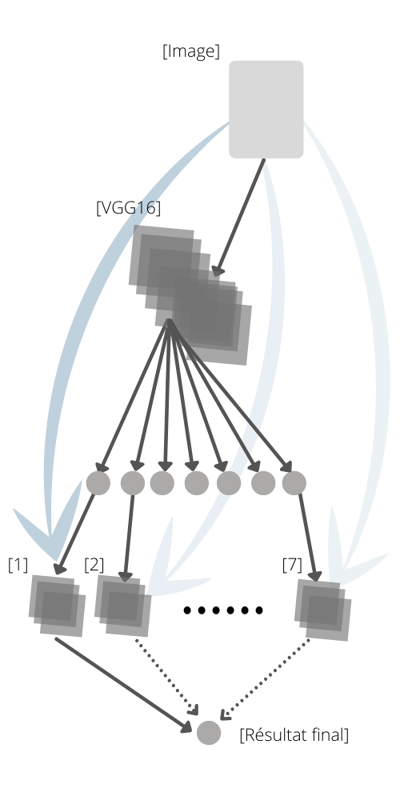

# Deaf mute talking / Sign Language Interpreter using Deep Learning
> Projects of an Educational Nature Concerning Sign Language
Recognition for the Deafs: An In-Depth Learning Based Study
of Upstream and Downstream Data Flows 

## Table of contents
* [General info](#general-info)
* [Technologies and Tools](#technologies-and-tools)
* [Dataset](#dataset)
* [Models and Architectures](#models-and-architectures)
* [Schema](#schema)
* [Contact](#contact)

## General info

American Sign Language (ASL) is a complete, natural language that has the same linguistic properties as spoken languages, with grammar that differs from English. ASL is expressed by movements of the hands and face. It is the primary language of many North Americans who are deaf and hard of hearing, and is used by many hearing people as well.

## Technologies and Tools
* Python 
* TensorFlow
* Keras

## Dataset
the data used are those of "ASL Alphabet Image data set for alphabets in the American Sign Language" de 
[asl-alphabet](https://www.kaggle.com/grassknoted/asl-alphabet)
Contains 87,000 images of 200x200
pixels RGB, and each image requires 25
KB of memory with 29 classes and
nearly 3000 images for each class,
including 26 for the letters A-Z and 3
classes for space, erasing and nothing,
these 3 classes are very useful for realtime applications and classification.

## Models and Architectures
* MLP 
* CNN
* VGG16

## Setup

* Use comand promt to setup environment by using install_packages.txt and install_packages_gpu.txt files. 
 
`pyton -m pip r install_packages.txt`

This will help you in installing all the libraries required for the project.

## Schema

## Contact
Created by me [Amine KERBOUTE](https://github.com/KERBOUTE)

If you loved what you read here and feel like we can collaborate to produce some exciting stuff, or if you
just want to shoot a question, please feel free to connect with me on <a href="aminekerboute@gmail.com" target="_blank">email</a>, 
<a href="https://www.linkedin.com/in/amine-kerboute/" target="_blank">LinkedIn</a>, or 
<a href="https://twitter.com/KerbouteA" target="_blank">Twitter</a>. 
My other projects can be found [here](https://github.com/KERBOUTE?tab=repositories).

